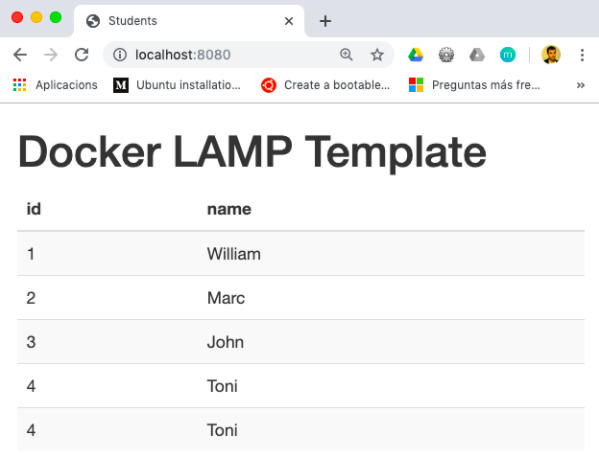

# Implantació d'aplicacions web
### Exàmen ordinari de la 1a avaluació

|                |                                                     |
| -------------- | --------------------------------------------------- |
| Cicle formatiu | CFGS Administració de Sistemes Informàtics en Xarxa |
| Curs           | 2020/2021                                           |
| Assignatura    | Implantació d'aplicacions web                       |
| Data           | 30/11/2020                                          |
| Alumne         | ______________________________________________      |

## Statement

Deploy using Docker containers a simple web application, located in this same repository, developed with PHP and MySQL.

To deploy this application you will need to create 3 containers:
* One with Apache, PHP and PHP libraries to be able to access MySQL. In this container it will be copied the HTML, PHP, etc. files located in the *www* folder of this repository. It will be based on an specific tag/version of the `php` image.
* One with a MySQL database server. This container will contain the database that the web application must access. It will be based on an specific tag/version of the `mysql` image. It must be initialized with the data in the `*.sql` files located in the *sql* folder of this repository.
* One with the PhpMyAdmin application to be able to manage the MySQL database through a web interface. It will be based on an specific tag/version of the `phpmyadmin/phpmyadmin` image.

In order to be able to launch the three containers in a coordinated way, it is recommended to use the Docker Compose tool (https://docs.docker.com/compose/).

Once deployed, the Apache web server, the MySQL database server, and PhpMyAdmin can be accessed through a given port of the host machine.

The following screenshot shows the result of accessing the web application, once deployed and up and running:

The points you have to deliver for this practice are:
1. (4 points) Files needed to configure Docker containers. In this repository you have to add the files `Dockerfile` and `docker-compose.yml` in order to configure the containers requested in the statement. You may have also to modify the `www\config.php` file.
    * (1,5 points) Apache, PHP and PHP libraries configuration
    * (1,5 points) MySQL configuration and initialization of the `*.sql` data
    * (1 point) PhpMyAdmin configuration
2. (1 point) Describe in the `README.md` file the software prerequisites to be able to run this project.
3. (1 point) Describe in the `README.md` file the instructions for running and stopping the containers.
4. (1 point) Describe in the `README.md` file the instructions for accessing the project website and phpMyAdmin. For example, enter their URLs.
5. (1 point) Describe in the `README.md` file the instructions for accessing each of the containers via a command terminal (bash shell).
6. (1 point) Describe in the `README.md` file the instructions to access the MySQL client of the container that has the database using command terminal.
7. (1 point) In the repository, create a `Project` to track the current *Sprint* with a [Kanban](https://es.wikipedia.org/wiki/Kanban) diagram of type *Basic kanban*. This *Sprint* must have at least the following *user stories* of the *product backlog*, in the form of `Issues`, which will be assigned to some developer of your project and will be distributed in different states (*To do*, *In progress*, *Done*):
   * The web application must be deployed to a Docker container
   * The database must be deployed to a Docker container
   * There will be a Docker container with the phpMyAdmin program to manage the database
   * The system administrator must be able to enter the containers via the command terminal
   * The system administrator must be able to enter the MySQL client via the command terminal

**NOTE**: The incorrect delivery of the exam and a limited number of commits may be penalized.

## 1. Files needed to configure Docker containers (4 points)
Look at the `Dockerfile`, `docker-compose.yml` and `www\config.php` files in this repository.

## 2. Prerequisites (1 point)
_____________ (To complete)

## 3. Run and stop the containers (1 point)
_____________ (To complete)

## 4. Access the web application and phpMyAdmin (1 point)
_____________ (To complete)

## 5. Enter via terminal (bash shell) the containers (1 point)
_____________ (To complete)

## 6. Enter the MySQL client via terminal (bash shell) (1 point)
_____________ (To complete)

## 7. Monitoring the development of this Sprint (1 point)
Look at the `Issues` and `Projects` menus in this repository

## Delivery format

You must submit to [Google Classroom](https://classroom.google.com) a link to a release of this GitHub repository.

* [How to create releases](https://help.github.com/articles/creating-releases/)

## References

* [Exploring Docker 1 - Getting Started, Traversy Media Youtube Video](https://youtu.be/Kyx2PsuwomE)
* [Exploring Docker 2 - Docker Compose With Node & MongoDB, Traversy Media Youtube Video](https://youtu.be/hP77Rua1E0c)
* [LAMP with Docker](https://magmax.org/blog/lamp-con-docker/)
* [LAMP WITH DOCKER, Youtube Video](https://www.youtube.com/watch?v=lrhwWX49Uss)
* [Project management in GitHub](https://github.com/features/project-management/)
